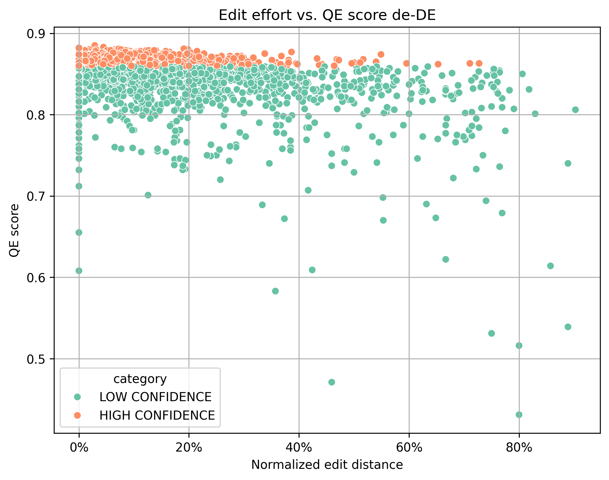
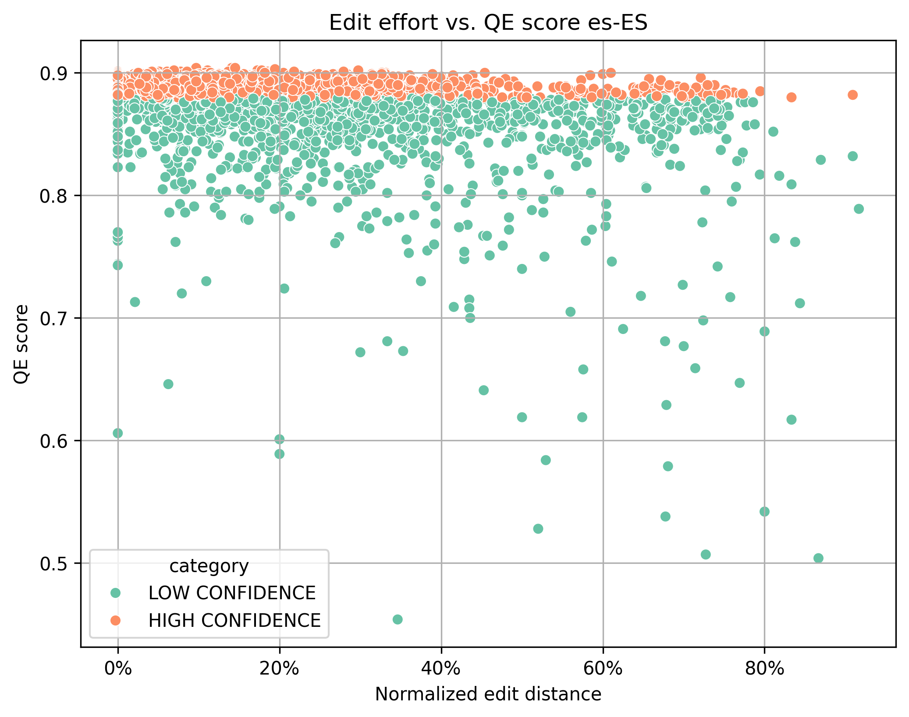
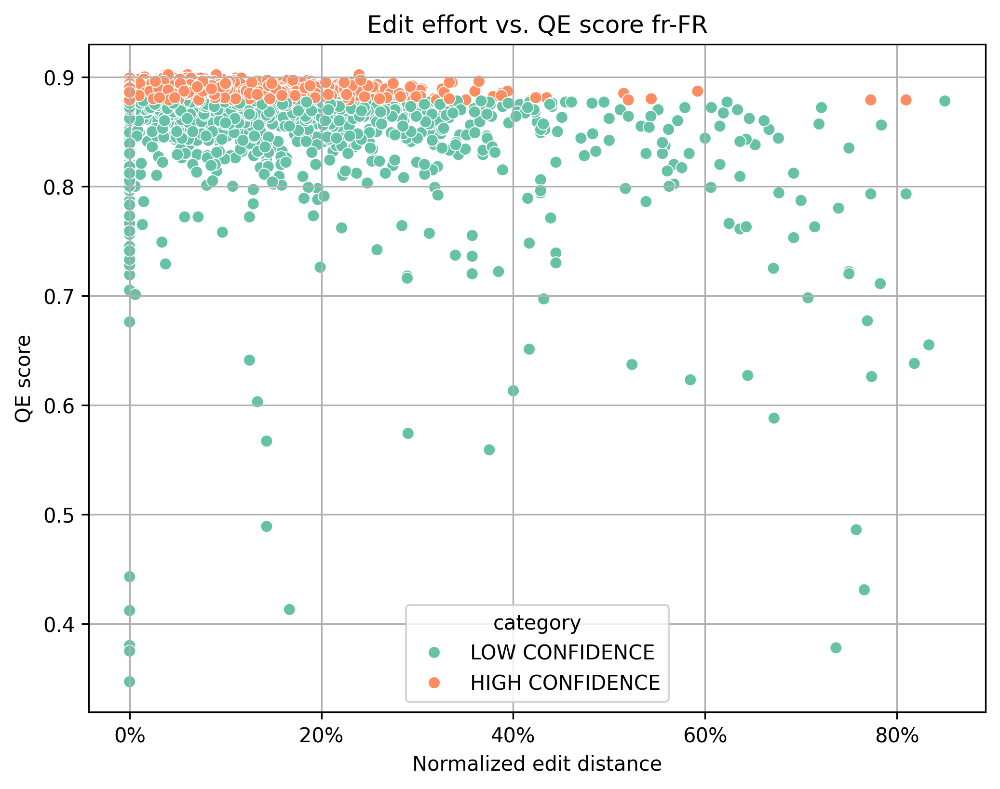
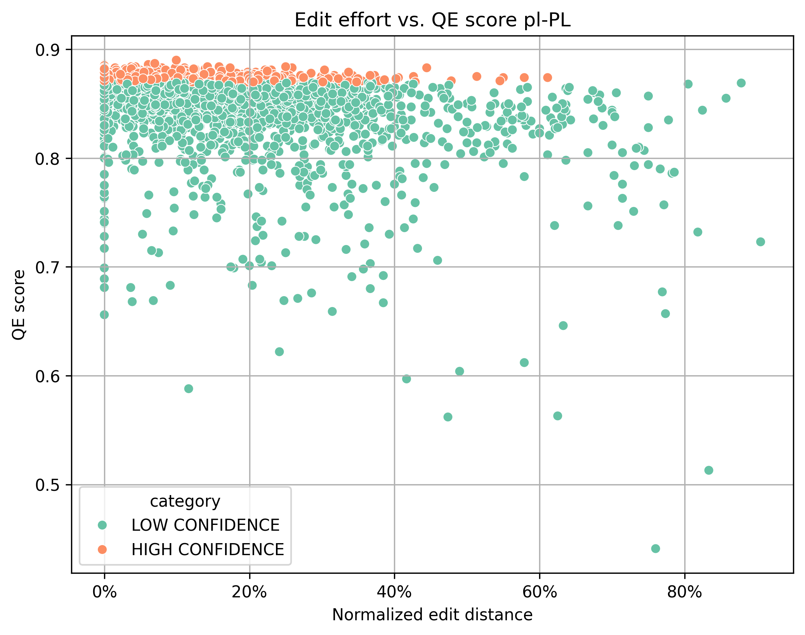
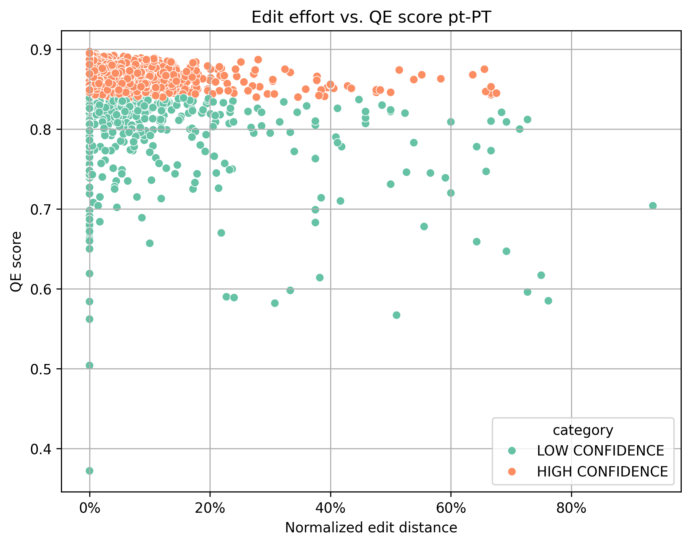
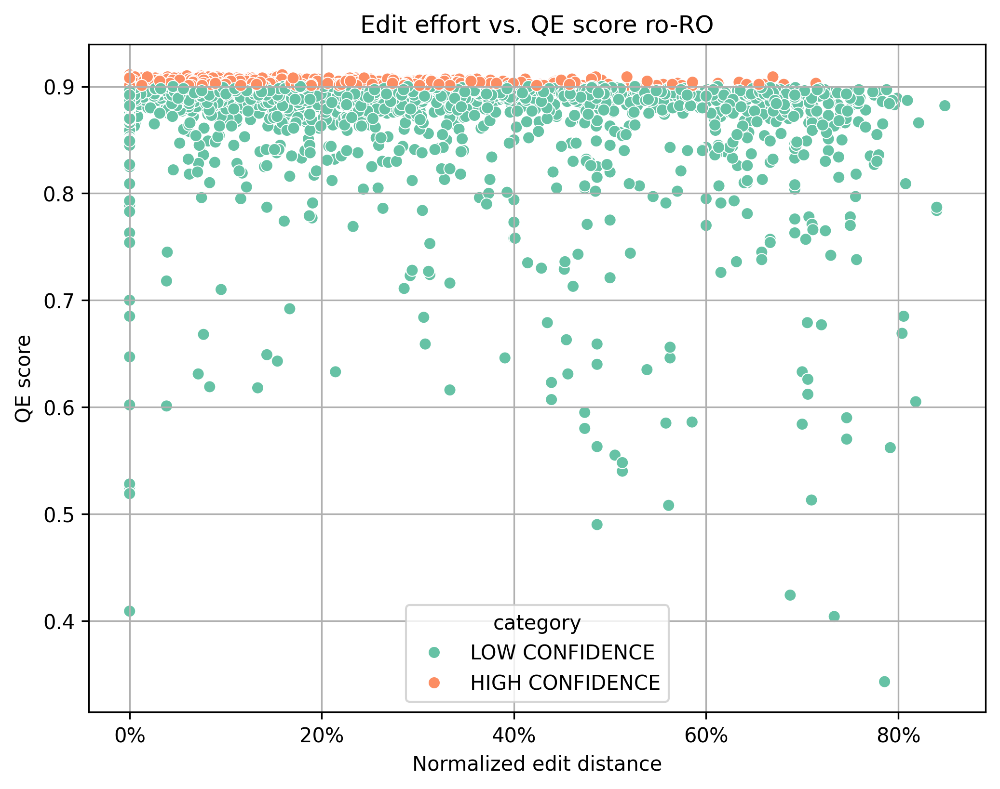

# Post MTPE tasks

## Analyze PE effort

### Getting started

Clone this repo, create a virtual environment, activate it and install all dependencies:

``` 
python -m venv venv
source venv/bin/activate
pip install -r requirements.txt
```

Make sure you use the python version indicated in file [`.python-version`](.python-version) (if you use pyenv, it should take care of the this for you).

One additional dependency must be installed differently: 

```
git clone https://github.com/capstanlqc/tmx2dataframe.git clone/tmx2dataframe
cd clone/tmx2dataframe
pip install .
```

### Getting the data

The data to be analyzed will be extracted from OmegaT projects after the PE task is concluded.

Clone all team projects or unpack all the projects you want to analyze in a folder, let's call it `repos`. Copy file [`config.json"`](user/config.json) to that folder to.

### Running

Run the script as:

``` 
python code/corr-score-edit.py --parent /path/to/repos --template "ysc-strata_*_omt"
```

where the two arguments are the following: 

- `--parent`: absolute path to the folder where all project have been cloned or unpacked
- `--template`: pattern including wildcards to match the project folders that should be considered

### Background

> What is this threshold: @Laura: how did you determine the threshold? 

The threshold draws the line between the translations that require PE (those which have a QE score below the threshold) and those that require no or minimal PE (those which have a QE score above the threshold). 

The *ideal threshold* would split all translations in two groups: high confidence translations (above the threshold, which have good quality without PE) and low confidence translations (below the threshold, which require PE).

Some fine-tuning is necessary to find the ideal threshold. 

### Goal 

The goal of this analysis of PE effort is to ascertain to what degree the threshold used was ideal or far from ideal and how much fine-tuning is needed.

The general hypothesis is that there is a linear relationship between the QE score assigned to MT translations and the PE effort used to improve them.

### Data

For each language pair (where English is always the source language), we collected the following data (for each segment in the project):

- source sentence
- initial MT version
- PE version
- edit distance (number of edits)
- similarity ratio
- QE score (Comet)
- confidence category
- deviation of QE score from threshold

The data sample includes the whole population. The two variables measured (similarity ratio and deviation of QE score from threshold) are paired. No data clean-up was done, so data might include outliers. 

We also computed the average similarity ratio between the initial MT version and the PE version for each of the two categories (high confidence and low confidence).

### Analysis

We analyzed correlation between two variables: 

- the distance or deviation of the QE score of each segment from the threshold
- the similarity between the initial MT and the PE versions

> The second magnitude is the opposite of the edit effort.

We have used two metrics to calculate the correlation coefficient (which measures the extent to which two variables tend to change together):

- Pearson correlatoin coefficient
- Spearman correlation coeficient

We have examined the relationship between the two variables with a scatterplot.

### Results

| Locale | Threshold | Pearson coefficient | Pearson P-value | Spearman coefficient | Spearman P-value |
|----|----|----|----|----|----|
| pt-PT | 0.84      | 0.373566088788977 | 3.02915498707086E-131 | 0.270483131207319 | 2.73690796762657E-67  |
| pl-PL | 0.87      | 0.394038614190113 | 4.28759280116097E-147 | 0.372445306402085 | 2.0727032912648E-130  |
| fr-FR | 0.87      | 0.340461984939205 | 6.16300411319614E-108 | 0.194437929986979 | 5.27246757422632E-35  |
| de-DE | 0.86      | 0.468501065695487 | 4.58098741147011E-215 | 0.352645304844544 | 3.42173552600613E-116 |
| ro-RO | 0.9       | 0.305989685321915 | 1.62160426139411E-86  | 0.344508570234265 | 1.22620953749372E-110 |
| es-ES | 0.88      | 0.345382876098042 | 3.15963260617931E-111 | 0.339930141525419 | 1.38620442294041E-107 |

Here are the scatter plots for visual insight:

| | |
|---|---|
|  |  |
|  |  |
|  |  |

See below average similarity ratio between the initial MT version and the PE version calculated for each of the two categories (high confidence and low confidence).

| Locale | High confidence | Low confidence |
|-------|------|------|
| pt-PT | 0.97 | 0.90 |
| pl-PL | 0.94 | 0.89 |
| fr-FR | 0.94 | 0.89 |
| de-DE | 0.95 | 0.88 |
| ro-RO | 0.91 | 0.82 |
| es-ES | 0.88 | 0.79 |

### Interpretation

Variables: The two variables whose relationship is measured are the PE effort and the deviation from the threshold. 

Metrics: The Pearson correlation coefficient measures the linear relationship between two variables and the Spearmanc correlation coefficient measures the monotonic relationship (not limited to linear) between two variables.

Strength: All Pearson coefficients range between 0.3 and 0.46, indicating weak to moderate positive linear relationships. Spearman coefficients range between 0.19 and 0.37, showing weaker but still statistically significant monotonic relationships.

In most locales, Pearson coefficients are higher than Spearman coefficients, suggesting that the relationships are more linear than monotonic. 

Significance: All Pearson p-values are extremely small, indicating that the linear relationships are statistically significant beyond any reasonable doubt, ruling out the possibility of random noise driving these results.

de-DE exhibits the strongest linear relationship, while pl-PL shows the strongest monotonic relationship. fr-FR has weaker relationships overall, suggesting potential differences in the underlying data trends for this locale.

### Follow-up

We could explore why some locales show weaker relationships.

# References

- [Pearson and Spearman Correlations: A Guide to Understanding and Applying Correlation Methods](https://datascientest.com/en/pearson-and-spearman-correlations-a-guide-to-understanding-and-applying-correlation-methods)
- [A comparison of the Pearson and Spearman correlation methods](https://support.minitab.com/en-us/minitab/help-and-how-to/statistics/basic-statistics/supporting-topics/correlation-and-covariance/a-comparison-of-the-pearson-and-spearman-correlation-methods/)
- [https://seaborn.pydata.org/tutorial/introduction.html](https://seaborn.pydata.org/tutorial/introduction.html)